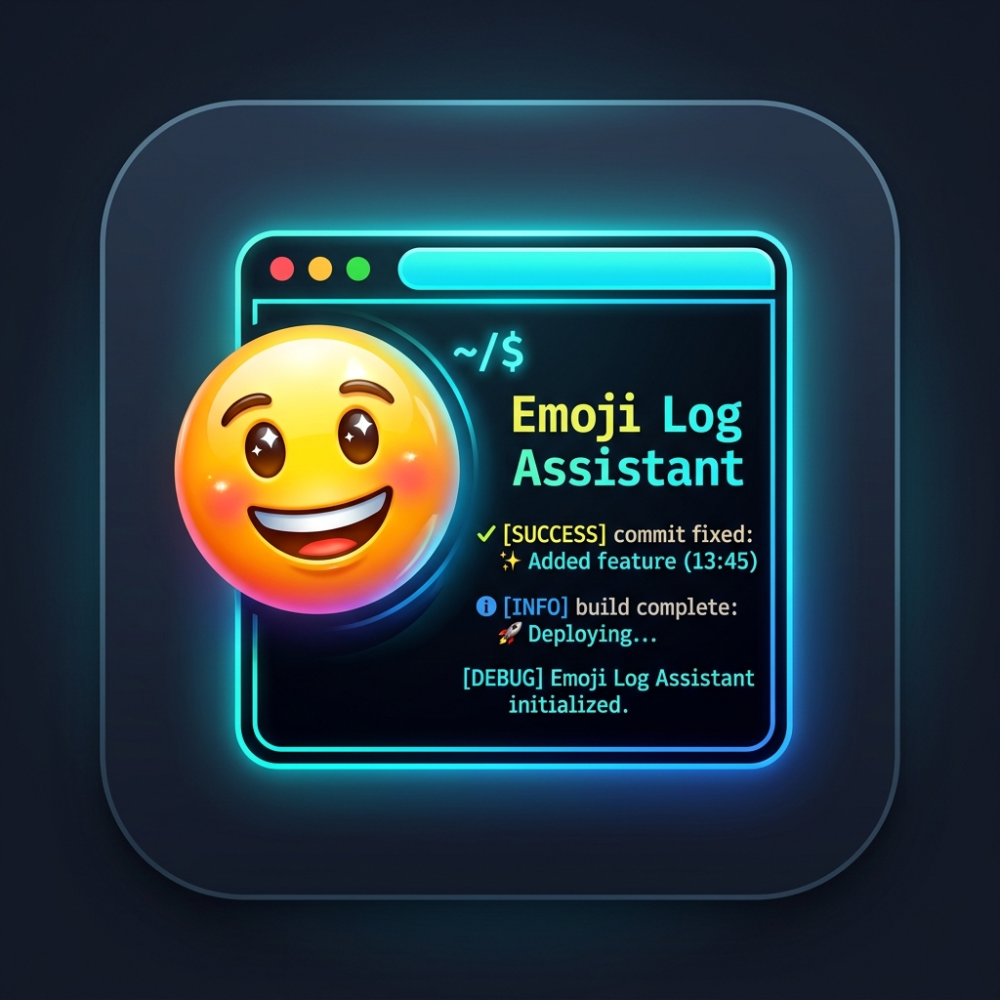

# Emoji Log Assistant 🚀



**Emoji Log Assistant** is a powerful VS Code extension that automatically transforms your boring, plain-text log statements into meaningful, emoji-rich debugging messages. It uses intelligent keyword detection and the community-maintained `emojilib` to find the most relevant emojis for your code.

## ✨ Features

- **🧠 Contextual Emojis:** Automatically detects the intent of your logs (e.g., success, error, sync, heartbeat) and adds matching emojis.
- **🌍 Multi-Language Support:** Works with JavaScript, TypeScript, Python, Java, Go, C#, Ruby, PHP, Rust, and many more.
- **⚡ One-Click Formatting:** Add emojis to all log statements in your entire file with a single command.
- **🛡️ Intelligent Skipping:** Automatically skips lines that already have emojis at the start to avoid duplication.

## 🚀 How it Works

The extension scans your file for common logging patterns and analyzes the string content. Using a combination of a curated manual map and dynamic searching, it prepends the perfect emoji to your strings.

### Before:
```javascript
console.error("Database connection failed")
console.log("User authentication success")
print("Loading user data")
```

### After:
```javascript
console.error("🚨 Database connection failed")
console.log("✅ User authentication success")
print("⏳ Loading user data")
```

## 🛠️ Supported Patterns

Emoji Log Assistant supports a wide range of logging functions:
- `console.log`, `info`, `warn`, `error`, `debug` (JS/TS)
- `print`, `println` (Python, Swift, Kotlin)
- `System.out.println` (Java)
- `fmt.Println`, `fmt.Printf` (Go)
- `Console.WriteLine` (C#)
- `logger.info`, `error`, `warn` (Generic loggers)
- `puts`, `echo` (Ruby, Shell, PHP)

## 📖 How to Use

1. Open any code file with log statements.
2. Open the **Command Palette** (`Ctrl+Shift+P` or `Cmd+Shift+P`).
3. Type **"Add Emojis to Console Logs"** and press Enter.
4. Enjoy your beautiful logs!

## 📦 Installation

Install directly from the [VS Code Marketplace](https://marketplace.visualstudio.com/items?itemName=abhijeettiwari.emoji-log-assistant) or search for **"Emoji Log Assistant"** in the VS Code Extensions view.

## 🤝 Contributing

Contributions, issues, and feature requests are welcome!
Feel free to check the [issues page](https://github.com/abhijeettiwari521/emoji-logs-assistant/issues).

---

Made with ❤️ by [Abhijeet Tiwari](https://github.com/abhijeettiwari521)

# emoji-logs-assistant
